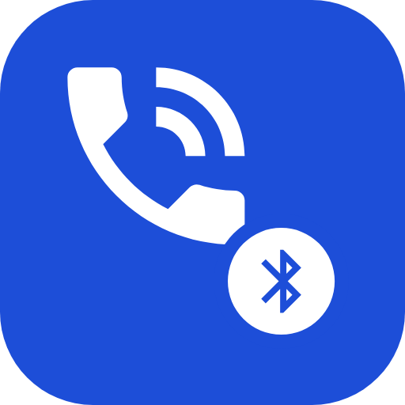
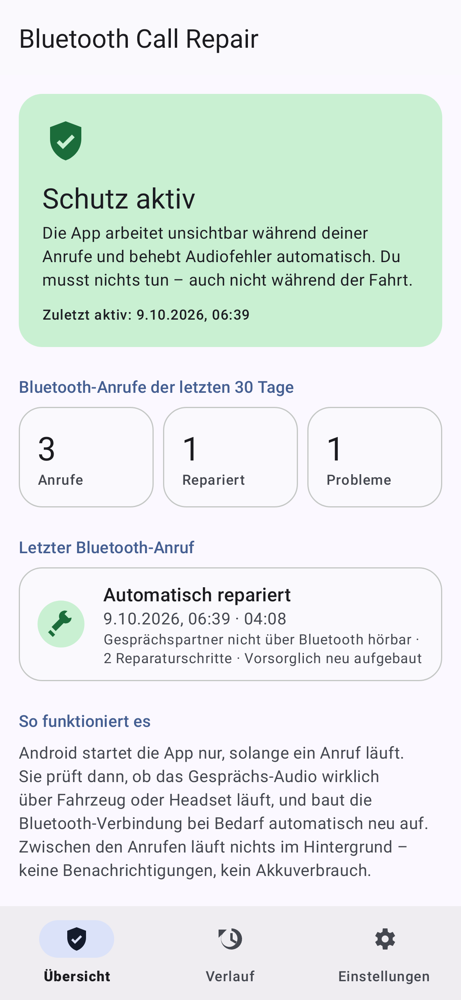
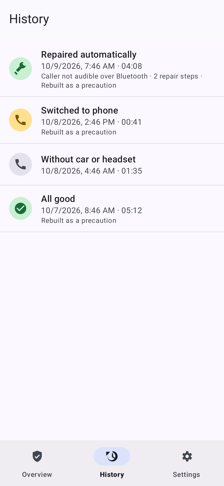
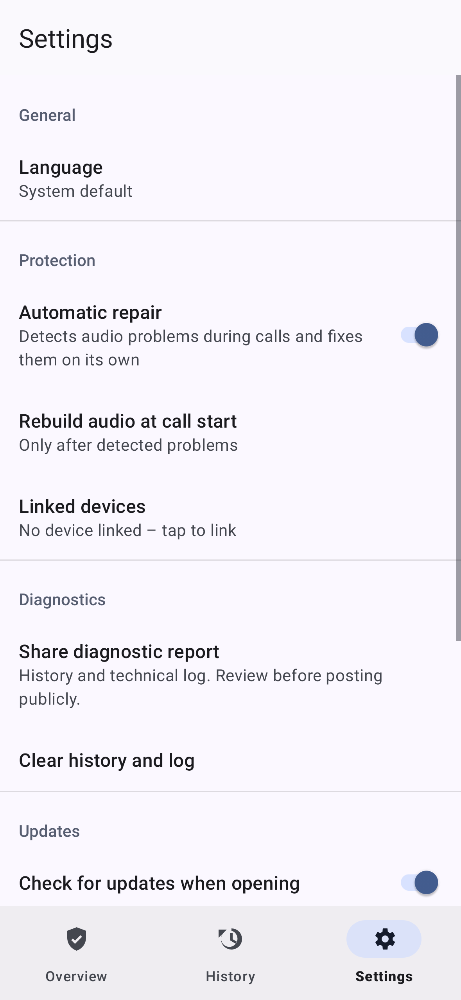

<p align="center">
  
</p>

<h1 align="center">Bluetooth Call Repair</h1>

<p align="center">
  <b>Fix for the Samsung Galaxy A52s 5G Bluetooth call bug:<br>
  the car or headset is connected, the other person hears you, but you can't hear them.</b>
</p>

<p align="center">
  <a href="https://github.com/KaiPressmar/a52s-bluetooth-repair/releases/latest"></a>
  <a href="https://github.com/KaiPressmar/a52s-bluetooth-repair/actions/workflows/ci.yml"></a>
  
  
  
  <a href="LICENSE"></a>
</p>

<p align="center">
  
  &nbsp;
  
  &nbsp;
  
</p>

## Is this my problem?

You probably have the known **Galaxy A52s 5G (SM-A528B / SM-A528N) Bluetooth call-audio bug** if, since One UI 6.1 / Android 14:

- ✅ Bluetooth to the car or headset stays connected and **music works**,
- ❌ but during **phone calls** you hear nothing, the other side hears nothing, or the call stays on the phone,
- 🔁 and only **restarting the phone** fixes it – until it happens again hours or days later.

Many owners report it since the January 2025 update. Samsung has reportedly ended updates for the A52s, so a vendor fix is unlikely. Background, affected firmware and community workarounds: [docs/A52S_CALL_AUDIO_ISSUE.md](docs/A52S_CALL_AUDIO_ISSUE.md).

> 🇩🇪 **Deutsch:** Galaxy A52s 5G – Bluetooth-Anruf im Auto oder mit Headset: Der Gesprächspartner hört mich, aber ich höre ihn nicht (kein Ton, einseitiges Audio, Freisprecheinrichtung stumm). Musik geht, nur ein Neustart hilft. Genau dafür ist diese App – komplett auf Deutsch und Englisch.

## Download and setup

1. **Download** [`bluetooth-repair.apk`](https://github.com/KaiPressmar/a52s-bluetooth-repair/releases/latest/download/bluetooth-repair.apk) on your phone (latest version, signed, with [SHA-256 checksum](https://github.com/KaiPressmar/a52s-bluetooth-repair/releases/latest)).
2. **Install** it. Android asks once to allow installing from your browser or file manager.
3. **Open the app** and complete the two one-time steps:
   - allow **Bluetooth access**;
   - tap **Link car**, pick your car and confirm the Android dialog. The dialog calls the car a "watch"; that is the only device type through which Android lets apps control call audio.
4. Done when the app shows **Protection active**. You never need to open it again; it updates itself from this repository.

*Alternative to step 3 with a computer:* `adb shell appops set de.kaipressmar.a52srepair MANAGE_ONGOING_CALLS allow`

## How it works

- **Invisible:** Android starts the app only while a call is in progress. Between calls nothing runs: no background service, no notifications, no battery use.
- **Hands-free:** while driving you only accept the call through the car. The app checks the call audio and repairs it on its own:
  - moves a call stuck on the phone to the car,
  - rebuilds the Bluetooth audio link (car → phone → car, about 1 second),
  - restores a muted call volume.
- **Preventive on the A52s:** a silent downlink inside Samsung's audio stack can't be detected by any app, so the app rebuilds the Bluetooth audio once at the start of every car call. You can switch this off.
- **Honest:** if Android offers no Bluetooth call route at all, no app can fix it. The app records it and tells you a restart is needed.

Repairs go through Android's call system (Telecom), exactly like the audio button in the phone app. [docs/ARCHITECTURE.md](docs/ARCHITECTURE.md) explains why earlier approaches could not work and shows the Android source evidence.

The app follows your phone's language (English or German) and can be switched under *Settings → Language*; on Android 13+ also in the system's per-app language settings.

## FAQ

<details><summary><b>Does it need root?</b></summary>

No. It only uses public Android APIs and a one-time system confirmation.
</details>

<details><summary><b>Does it drain the battery or show notifications?</b></summary>

No. Android binds the app only during calls; otherwise it doesn't run at all and never posts notifications.
</details>

<details><summary><b>Why does the call briefly switch to the phone at the start?</b></summary>

That is the preventive rebuild of the Bluetooth audio link on the A52s. It takes about one second and prevents the "I can't hear them" fault. In the settings you can change it to "only after problems" or switch it off.
</details>

<details><summary><b>Why does the setup dialog mention a watch and permissions?</b></summary>

Android's companion-device "watch" profile is the only one that allows apps to control ongoing calls. The app requests no further permissions and sends no data. If you prefer, use the one-line adb alternative instead.
</details>

<details><summary><b>Does it work on other phones?</b></summary>

It runs on any phone with Android 12–16 and adapts at runtime. It was built for the Galaxy A52s 5G and is also used on a Galaxy S22. Reports from other phones are welcome.
</details>

<details><summary><b>What data does it collect?</b></summary>

Nothing leaves your phone except the update check against GitHub. The call history keeps times, durations and results only, never numbers or names, and is excluded from backups.
</details>

## Help improve it

This project depends on reports from real cars and firmware versions. You can help by:

- **Reporting a failed call:** [open a call-audio report](https://github.com/KaiPressmar/a52s-bluetooth-repair/issues/new?template=1-call-audio-problem.yml). Before rebooting, share the diagnostic report from the app (*Settings → Share diagnostic report*).
- **Sharing a field report**, even if everything works: [which car, which firmware, what happened](https://github.com/KaiPressmar/a52s-bluetooth-repair/issues/new?template=2-field-report.yml).
- **Asking questions** in [Discussions](https://github.com/KaiPressmar/a52s-bluetooth-repair/discussions).
- **Starring the repository**, so other A52s owners find it.

Code contributions are welcome. See [CONTRIBUTING.md](CONTRIBUTING.md).

## For developers

```
core/      Pure Java domain logic: fault classification, per-call repair state machine, reports
app/       Android app (one universal APK): Telecom service, audio probes, setup, UI, updates
docs/      Issue research, architecture, field reports
scripts/   Toolchain setup and on-device state capture
```

[](https://codespaces.new/KaiPressmar/a52s-bluetooth-repair)

The quickest start is the **dev container** (`.devcontainer/`): JDK 21 and the Android SDK exactly as in CI, recommended VS Code extensions (Java/Gradle, Claude Code, Codex, GitHub, Container Tools …), access to the host's Docker daemon and a persistent Gradle cache. Open it in GitHub Codespaces or with *Dev Containers: Reopen in Container* in VS Code.

Without containers: JDK 17+ (CI uses 21), Android SDK platform 37 and build-tools 36; `scripts/setup-dev-env.sh` installs everything without root. The Gradle wrapper pins Gradle 9.8.

    ./gradlew :core:test :app:testDebugUnitTest :app:lintDebug :app:assembleDebug

The tests also render every screen and the launcher icon to `app/build/screenshots/`. Releases are signed, checksummed and attested by CI when `RELEASE_VERSION` changes on `main` ([RELEASING.md](RELEASING.md)). Testing strategy and the real-device protocol: [TESTING.md](TESTING.md).

## License and disclaimer

[MIT](LICENSE) © Kai Preßmar. Independent project, not affiliated with Samsung or Google. Experimental software: use at your own risk, and never operate your phone while driving (the app is designed so you don't have to).
